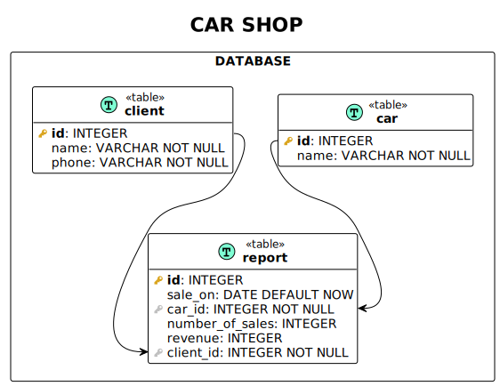

### Spring Boot REST-service

Introduction:
* The company owns a car dealership.
* The car dealership keeps records of products sold for each day, which takes into account the name of the car,
quantity, total cost and details of the buyer.

Requests:
* Car dealership revenue for a given period (input data: start date, end date of the period; output data: revenue);
* An array of orders ordered by the order date, within the date by the customer's FI, within the customer by the order
amount (input data: none; output data: the customer's last name and first name, contact number, order value,
order date, car model, number of cars in the order).

[Swagger REST API](http://localhost:8080/swagger-ui.html)

Database schema:

